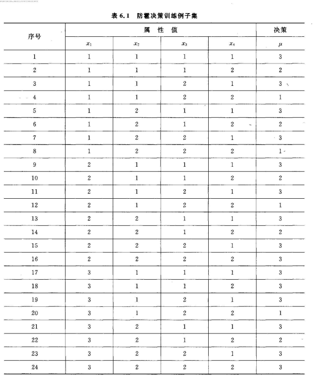
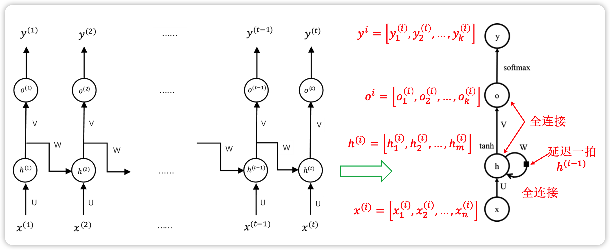

# 人工智障导论 2021

1. alpha-beta 剪枝。要求：1）标出每个节点的值；2）表明在何处剪枝；3）画出最终选择的走步。（P.S. 给的树是“不齐”的。）

2. 修正的 A\* 算法。给出求解过程、依次拓展的节点、最终选择的路径。

3. 非线性可分的 SVM 。

    样本：正例： $\boldsymbol{x_1}=(0, 0)^T$ ；负例： $\boldsymbol{x_2}=(1, 1)^T$ ， $\boldsymbol{x_3}=(-1, -1)^T$ 。

    核函数： $K(\boldsymbol{x}, \boldsymbol{y}) = (1 + \boldsymbol{x}^T \boldsymbol{y})^2$ 。

    请求解 SVM 参数，并给出 $(0, 1)^T$ 的分类。

4. （1）模拟退火。（温度固定，类似往年题。）

    （2）遗传算法。（类似 PPT 例题。）

5. 决策树。用 ID3 算法建立决策树，只需给出根节点及其子节点，表明叶节点的类别。

6. 设计智障神经网络：输入单个数字的图片，输出对应的英文单词（one, two, ...）。要求使用 MLP、CNN、RNN 。画示意图，简要说明。

# 口头考纲

> credit to 计 06 班学习委员，salute

- CH1

> A 和 A* 算法
>
> 易错：A* 算法结束条件 (目标点在OPEN表中第一个)
>
> 
>
> 

- CH2

> 基本CNN RNN LSTM 及典型应用
>
> BP 算法的推导
>
> 典型神经网络系统
>
> ResNet、GoogleNet
>
> 给出图，能说出每部分（？？）
>
> 词向量
>
> 掌握实现方法

- CH3

>  alpha-beta剪枝
>
>  易错：注意找全所有祖先节点（不只是父节点），最佳走步只能标一步
>
>  蒙特卡洛树搜索
>
>  重点是选择过程
>
>  AlphaGo / AlphaGo Zero
>
>  大概懂就行：两个网络、结合蒙特卡洛
>
>  
>
>  
>
>  

- CH4

>  SVM
>
>  会用对偶的方法求就行（ppt上例题）
>
>  决策树
>
>  给定数据，会用ID3/C4.5建树
>
>  **SVM**例题见最上方2021回忆版
>
>  **ID3决策树**
>
>  
>
>  
>
>  
>
>  

这棵决策树按照 ID3，第一个节点完了之后再分下 A2，熵就归零了。

**注：按马老师上课所说，第二章和第三章设计神经网络的部分不会单独出算法题，而应该是类似2021回忆版的最后一题，老师会出一个带有点创新的思考题，用到神经网络的知识。**

# 练习题

# A*

```mermaid
flowchart TD
      1(["S(7)"])--3-->2(["A(5)"])
      1--2-->3(["B(7)"])
      1--5-->4(["C(1)"])
      1--4-->5(["D(2)"])
      2--2-->3--1-->4--5-->5
      2--7-->6["E(5)"]
      4--2-->6--1-->7(["T"])
      
```

| NEST           | OPEN                   | CLOSE                                                | f(m) |
| -------------- | ---------------------- | ---------------------------------------------------- | ---- |
| 空             | S(7)                   | 空                                                   | 0    |
| D(4+2), C(5+1) | A(3+5), B(2+7)         | S(7)                                                 | 7    |
| C(5+1)         | A(3+5), B(2+7)         | D(4+2), S(7)                                         | 7    |
| 空             | A(3+5), B(2+7), E(7+5) | D(4+2), C(5+1), S(7)                                 | 7    |
| 空             | B(2+7), E(7+5)         | D(4+2), C(5+1), S(7), A(3+5)                         | 8    |
| C(3+1)         | E(7+5)                 | D(4+2), C(5+1), S(7), A(3+5), B(2+7)                 | 9    |
| 空             | E(5+5)                 | C(3+1), D(4+2), C(5+1), S(7), A(3+5), B(2+7)         | 9    |
| T(6+0)         | 空                     | C(3+1), D(4+2), C(5+1), S(7), A(3+5), B(2+7), E(5+5) | 10   |

# 决策树

# 设计神经网络

## RNN

- 设计如图所示的 RNN 神经网络，将输入张量逐列与参数矩阵 U 相乘输入记忆神经元，然后经过 tanh 激活，再与 W 矩阵相乘后记忆下来，与新输入的列与 U 的乘积相加。先输入的列得到了记忆，并且利用了后输入的列，构造了循环神经网络。最后循环神经元输出的结果与参数矩阵 V 相乘，经过 softmax 输出概率。计算损失函数而后回传梯度下降。

## Text-CNN

- 依据[参考文献](https://arxiv.org/abs/1408.5882)中的模型搭建 Text-CNN 模型。前向传播流程如下：

1. 嵌入层：将每个表示单词的自然数映射为指定长度的向量，即用向量表示单词。
2. 一维多通道多卷积核卷积层：将嵌入层得到的数据视为一批多通道的一维张量；一维张量的长度为对齐后的句子长度，通道数为词向量的数。用指定数量与大小的卷积核与输入数据做多通道多卷积核卷积，得到多通道的一维输出特征。用宽度为 3、5、7 的卷积核分别做三次卷积。
3. 池化层：对卷积结果进行 activate, Dropout, max pooling。
4. 线性层：将池化后的卷积结果拼接在一起，得到长度为所有卷积输出通道数之和的张量，再经过一层线性层得到表示类别标签预测的向量。

## MLP

使用 MLP 作为 baseline 。模型示意图如上，前向传播大致流程如下：

1. 嵌入层：将每个表示单词的自然数映射为指定长度的向量，即用向量表示单词。
2. 线性层1：接收一批将句子中的词向量直接拼接起来得到的张量为输入，输出指定大小的张量，然后进行 Batch Normalization, Activation, Dropout。
3. 线性层2：输出表示类别标签预测的向量。

