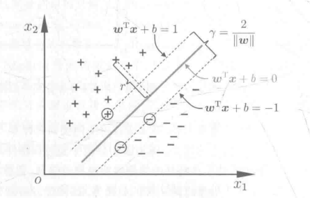
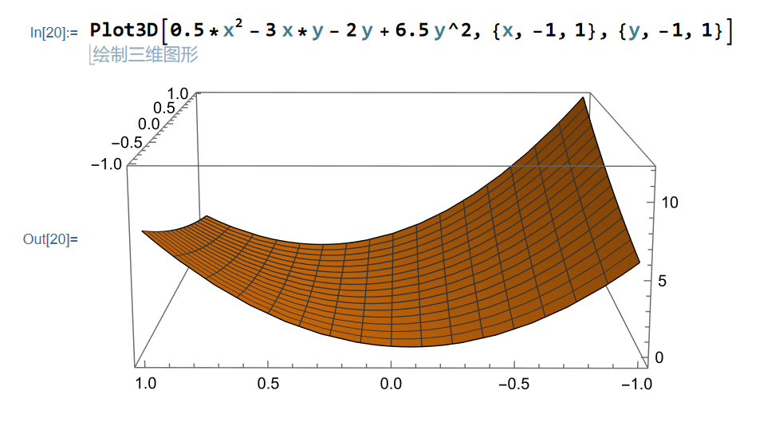
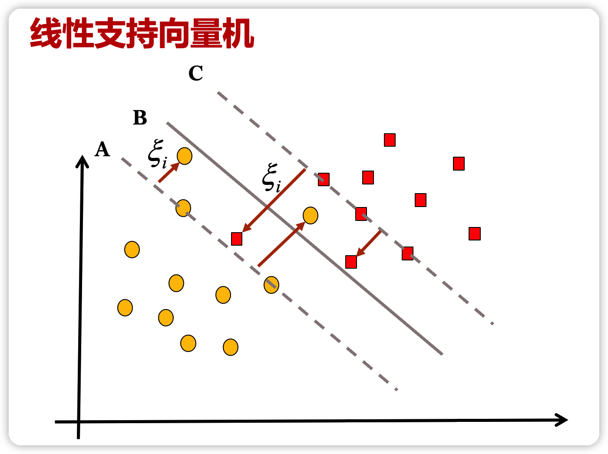
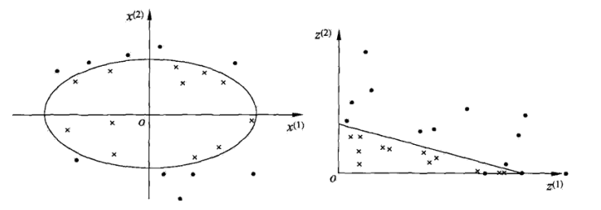

# 朴素贝叶斯法（naive Bayes）

朴素贝叶斯(naive-Bayes) 朴素贝叶斯(naive Bayes) 法是基于**贝叶斯定理**与**特征条件独立假设**的分类方法。对于给定的训练数据集，首先基于*特征条件独立假设*学习**输入/输出**的联合概率分布；然后基于此模型，对给定的输入 x，利用贝叶斯定理求出后验概率最大的输出 y。朴素贝叶斯法实现简单，学习与预测的效率都很高，是一种常用的方法。

## 学习与分类

### 基本原理

设输入空间 $\mathcal{X} \subseteq \mathbf{R}^{n}$ 为 n 维向量的集合, 输出空间为类标记集合 $\mathcal{Y}=\left\{c_{1}\right., \left.c_{2}, \cdots, c_{K}\right\}$. 输入为特征向量 $x \in \mathcal{X}$, 输出为类标记 (class label) $y \in \mathcal{Y}$ 。 X 是定义在输入空间 $\mathcal{X}$ 上的随机向量, Y 是定义在输出空间 $\mathcal{Y}$ 上的随机变量. $P(X, Y)$ 是 X 和 Y 的联合概率分布。训练数据集
$$
T=\left\{\left(x_{1}, y_{1}\right),\left(x_{2}, y_{2}\right), \cdots,\left(x_{N}, y_{N}\right)\right\}
$$
**由 P(X, Y) 独立同分布产生。**

朴素贝叶斯法通过训练数据集学习联合概率分布 P(X, Y)。具体地, 学习以下先验概率分布及条件概率分布。先验概率分布
$$
P\left(Y=c_{k}\right), \quad k=1,2, \cdots, K
$$
条件概率分布
$$
P\left(X=x \mid Y=c_{k}\right)=P\left(X^{(1)}=x^{(1)}, \cdots, X^{(n)}=x^{(n)} \mid Y=c_{k}\right), \quad k=1,2, \cdots, K
$$
于是学习到联合概率分布 P(X, Y)。

条件概率分布 $P\left(X=x \mid Y=c_{k}\right)$ 有指数级数量的参数, 其估计实际是不可行的。 

朴素贝叶斯法对条件概率分布作了**条件独立性**的假设。由于这是一个较强的假设, 朴素贝叶斯法也由此得名。具体地, 条件独立性假设是
$$
\begin{aligned}\\P\left(X=x \mid Y=c_{k}\right) &=P\left(X^{(1)}=x^{(1)}, \cdots, X^{(n)}=x^{(n)} \mid Y=c_{k}\right) \\\\&=\prod_{j=1}^{n} P\left(X^{(j)}=x^{(j)} \mid Y=c_{k}\right)\\\end{aligned}
$$
朴素贝叶斯法实际上学习到生成数据的机制, 所以属于生成模型。`条件独立假设等于是说用于分类的特征在类确定的条件下都是条件独立的`。这一假设使朴素贝叶斯法变得简单, 但有时会牺牲一定的分类准确率。

朴素贝叶斯法分类时, 对给定的输入 x, 通过学习到的模型计算后验概率分布 $P\left(Y=c_{k} \mid X=x\right)$, 将后验概率最大的类作为 x 的类输出。后验概率计算根据贝叶斯定理进行:
$$
P\left(Y=c_{k} \mid X=x\right)=\frac{P\left(X=x \mid Y=c_{k}\right) P\left(Y=c_{k}\right)}{\sum_{k} P\left(X=x \mid Y=c_{k}\right) P\left(Y=c_{k}\right)}
$$
再由独立性假设：
$$
P\left(Y=c_{k} \mid X=x\right)=\frac{P\left(Y=c_{k}\right) \prod_{j} P\left(X^{(j)}=x^{(j)} \mid Y=c_{k}\right)}{\sum_{k} P\left(Y=c_{k}\right) \prod_{j} P\left(X^{(j)}=x^{(j)} \mid Y=c_{k}\right)}, \quad k=1,2, \cdots, K
$$
这是朴素贝叶斯法分类的基本公式。于是，朴素贝叶斯分类器可表示为
$$
y=f(x)=\arg \max _{c_{k}} \frac{P\left(Y=c_{k}\right) \prod_{j} P\left(X^{(j)}=x^{(j)} \mid Y=c_{k}\right)}{\sum_{k} P\left(Y=c_{k}\right) \prod_{j} P\left(X^{(j)}=x^{(j)} \mid Y=c_{k}\right)}
$$
注意到对所有y，分母都是相同的，因此不用计算：
$$
y=\arg \max _{c_{k}} P\left(Y=c_{k}\right) \prod_{j} P\left(X^{(j)}=x^{(j)} \mid Y=c_{k}\right)
$$

## 参数估计

### 极大似然估计

在朴素贝叶斯法中, 学习意味着估计 $P\left(Y=c_{k}\right)$ 和 $P\left(X^{(j)}=x^{(j)} \mid Y=c_{k}\right).$ 可以应用极大似然估计法估计相应的概率。先验概率 $P\left(Y=c_{k}\right)$ 的极大似然估计是
$$
P\left(Y=c_{k}\right)=\frac{\sum_{i=1}^{N} I\left(y_{i}=c_{k}\right)}{N}, k=1,2, \cdots, K
$$
设第 $j$ 个特征 $x^{(j)}$ 可能取值的集合为 $\left\{a_{j 1}, a_{j 2}, \cdots, a_{j s_{j}}\right\}$, 条件概率 $P\left(X^{(j)}=a_{j l} \mid Y=c_{k}\right)$ 的极大似然估计是
$$
\begin{array}{l}\\P\left(X^{(j)}=a_{j l} \mid Y=c_{k}\right)=\frac{\sum_{i=1}^{N} I\left(x_{i}^{(j)}=a_{j l}, y_{i}=c_{k}\right)}{\sum_{i=1}^{N} I\left(y_{i}=c_{k}\right)} \\\\j=1,2, \cdots, n ; \quad l=1,2, \cdots, S_{j} ; k=1,2, \cdots, K\end{array}
$$
式中, x_{i}^{(j)} 是第 i 个样本的第 j 个特征; a_{j l} 是第 j 个特征可能取的第 l 个值; I 为 指示函数。

### 贝叶斯估计

用极大似然估计可能会出现**所要估计的概率值为 0** 的情况。这时会影响到后验概率的计算结果, 使分类产生偏差。解决这一问题的方法是采用贝叶斯估计。具体地, 条件概率的贝叶斯估计是
$$
P_{\lambda}\left(X^{(j)}=a_{j l} \mid Y=c_{k}\right)=\frac{\sum_{i=1}^{N} I\left(x_{i}^{(j)}=a_{j l}, y_{i}=c_{k}\right)+\lambda}{\sum_{i=1}^{N} I\left(y_{i}=c_{k}\right)+S_{j} \lambda}
$$
式中 $\lambda \geqslant 0$。等价于在随机变量各个取值的频数上赋予一个正数 $\lambda>0$. 当 $\lambda=0$ 时 就是极大似然估计。常取 $\lambda=1$, 这时称为拉普拉斯平滑 (Laplace smoothing)。显然, 对任何 $l=1,2, \cdots, S_{j}, k=1,2, \cdots, K$, 有
$$
\begin{array}{l}\\P_{\lambda}\left(X^{(j)}=a_{j l} \mid Y=c_{k}\right)>0 \\\sum_{l=1}^{s_{j}} P\left(X^{(j)}=a_{j} \mid Y=c_{k}\right)=1\\\end{array}
$$
表明式 (4.10) 确为一种概率分布。同样, 先验概率的贝叶斯估计
$$
P_{\lambda}\left(Y=c_{k}\right)=\frac{\sum_{i=1}^{N} I\left(y_{i}=c_{k}\right)+\lambda}{N+K \lambda}
$$

## 算法流程

输入: 训练数据 $T=\left\{\left(x_{1}, y_{1}\right),\left(x_{2}, y_{2}\right), \cdots,\left(x_{N}, y_{N}\right)\right\}$, 其中 $x_{i}=\left(x_{i}^{(1)}, x_{i}^{(2)}, \cdots, x_{i}^{(n)}\right)^{\mathrm{T}}, x_{i}^{(j)}$ 是第 i 个样本的第 j 个特征, $x_{i}^{(j)} \in\left\{a_{j 1}, a_{j 2}, \cdots, a_{j s_{j}}\right\}, a_{j 1}$ 是第 j 个特征可能取 的第 l 个值, $j=1,2, \cdots, n, l=1,2, \cdots, S_{j}, y_{i} \in\left\{c_{1}, c_{2}, \cdots, c_{K}\right\}$ ； 实例 x;

输出：实例 x 的分类。

（1）计算先验概率及条件概率
$$
\begin{array}{l}\\P\left(Y=c_{k}\right)=\frac{\sum_{i=1}^{N} I\left(y_{i}=c_{k}\right)}{N}, \quad k=1,2, \cdots, K \\P\left(X^{(j)}=a_{j 1} \mid Y=c_{k}\right)=\frac{\sum_{i=1}^{N} I\left(x_{i}^{(j)}=a_{j}, y_{i}=c_{k}\right)}{\sum_{i=1}^{N} I\left(y_{i}=c_{k}\right)} \\j=1,2, \cdots, n ; \quad l=1,2, \cdots, S_{j} ; \quad k=1,2, \cdots, K\end{array}
$$
（2）对于给定的实例 $x=\left(x^{(1)}, x^{(2)}, \cdots, x^{(n)}\right)^{\mathrm{T}}$, 计算
$$
P\left(Y=c_{k}\right) \prod_{j=1}^{n} P\left(X^{(j)}=x^{(j)} \mid Y=c_{k}\right), \quad k=1,2, \cdots, K
$$
(3) 确定实例 x 的类
$$
y=\arg \max _{c_{k}} P\left(Y=c_{k}\right) \prod_{j=1}^{n} P\left(X^{(j)}=x^{(j)} \mid Y=c_{k}\right)
$$

# 支持向量机（SVM）

## 线性可分支持向量机

给定训练样本集 $D=\left\{\left(x_{1}, y_{1}\right),\left(x_{2}, y_{2}\right). \ldots,\left(x_{m}, y_{m}\right)\right\}, y_{i} \in\{-1,+1\}$，分类学习最基本的想法就是基于训练集 D 在样本空间中找到一个划分超平面，将不同类别的样本分开。但能将训练样本分开的划分超平面可能有很多，我们应该努力去找到哪一个呢?

直观上看，应该去找位于两类训练样本“正中间”的划分超平面，因为该划分超平面对训练样本局部扰动的“容忍”性最好。例如，由于训练集的局限性或噪声的因素，训练集外的样本可能比图中的训练样本更接近两个类的分隔界，这将使许多其他划分超平面出现错误，而居中的超平面受影响最小。换言之，这个划分超平面所产生的分类结果是最鲁棒的，对未见示例的泛化能力最强。

在样本空间中, 划分超平面可通过如下线性方程来描述:
$$
\boldsymbol{w}^{\mathrm{T}} \boldsymbol{x}+b=0
$$
其中 $\boldsymbol{w}=\left(w_{1} ,w_{2}  \cdots  w_{d}\right)$ 为法向量，决定了超平面的方向； b 为位移项，决定了超平面与原点之间的距离。显然，划分超平面可被法向量 $\boldsymbol{w}$ 和位移 b 确定，面我们将其记为 $(\boldsymbol{w}, b)$。样本空间中任意点 $\boldsymbol{x}$ 到超平面 $(\boldsymbol{w}, b)$ 的距离可写为：
$$
r=\frac{\left|\boldsymbol{w}^{\mathrm{T}} \boldsymbol{x}+b\right|}{\|\boldsymbol{w}\|}
$$
假设超平面 $(\boldsymbol{w}, b)$ 能将训练样本正确分类，即对于 $\left(\boldsymbol{x}_{i}, y_{i}\right) \in D$，若 $y_{i}= +1$，则有 $\boldsymbol{w}^{\mathrm{T}} \boldsymbol{x}_{i}+b>0$；若 $y_{i}=-1$，则有 $\boldsymbol{w}^{\mathrm{T}} \boldsymbol{x}_{i}+b<0$。令
$$
\left\{\begin{array}{ll}\boldsymbol{w}^{\mathrm{T}} \boldsymbol{x}_{i}+b \geqslant+1, & y_{i}=+1 \\\boldsymbol{w}^{\mathrm{T}} \boldsymbol{x}_{i}+b \leqslant-1, & y_{i}=-1\\\end{array}\right.
$$
如图所示，**距离超平面最近的这几个训练样本点使式的等号成立**，它们被称为支持向量 (support vector), 两个异类支持向量到超平面的距离之和为
$$
\gamma=\frac{2}{\|w\|}
$$
它被称为间隔**(margin)**。

欲找到具有 “最大间隔” (maximum margin)的划分超平面，也就是要找到能满足式中约束的参数 $\boldsymbol{w}$ 和 b，使得 $\gamma$ 最大，即
$$
\begin{aligned}\max _{\boldsymbol{w}, b} & \frac{2}{\|\boldsymbol{w}\|} \\\text { s.t. } & y_{i}\left(\boldsymbol{w}^{\mathrm{T}} \boldsymbol{x}_{i}+b\right) \geqslant 1, \quad i=1,2, \ldots, m .\\\end{aligned}
$$
此即支持向量机的基本型。

在决定分离超平面时只有支持向量起作用，而其他实例点并不起作用。如果移动支持向量将改变所求的解；但是如果在间隔边界以外移动其他实例点，甚至 去掉这些点，则解是不会改变的。由于支持向量在确定分离超平面中起着决定性作用，所以将这种分类模型称为支持向量机。支持向量的个数一般很少，所以支持向量机由很少的**“重要的”**训练样本确定。

### 对偶方法

为了求解线性可分支持向量机的最优化问题，将它作为原始最优化问题，应用拉格朗日对偶性(参阅附录C) ，通过求解对偶问题(dual problem) 得到原始问题(primal problem) 的最优解，这就是线性可分支持向量机的对偶算法(dual algorithm)。这样做的优点，一是对偶问题往往更容易求解；二是自然引入核函数，进而推广到非线性分类问题。

首先构建拉格朗日函数 (Lagrange function)。为此，对每一个不等式约束引进拉格朗日乘子 $(Lagrange multiplier)\quad \alpha_{i} \geqslant 0, i=1,2, \cdots, N$  定义拉格朗日函数:
$$
L(w, b, \alpha)=\frac{1}{2}\|w\|^{2}-\sum_{i=1}^{N} \alpha_{i} y_{i}\left(w \cdot x_{i}+b\right)+\sum_{i=1}^{N} \alpha_{i}
$$
其中, $\alpha=\left(\alpha_{1},\alpha_{2}, \cdots, \alpha_{N}\right)^{\mathrm{T}}$ 为拉格朗日乘子向量。

根据拉格朗日对偶性, 原始问题的对偶问题是极大极小问题:
$$
\max _{\alpha} \min _{w, b} L(w, b, \alpha)
$$
所以，为了得到对偶问题的解，需要先求 $L(w, b, \alpha)$ 对 w, b 的极小，**再求对 $\alpha$ 的极大**。

由偏导为 0 可以得到如下条件
$$
\min _{w, b} L(w, b, \alpha)=-\frac{1}{2} \sum_{i=1}^{N} \sum_{j=1}^{N} \alpha_{i} \alpha_{j} y_{i} y_{j}\left<x_{i} \cdot x_{j}\right>+\sum_{i=1}^{N} \alpha_{i}
$$
再求对$\alpha$的极大，有：
$$
\begin{array}{ll}\min _{\alpha} & \frac{1}{2} \sum_{i=1}^{N} \sum_{j=1}^{N} \alpha_{i} \alpha_{j} y_{i} y_{j}\left(x_{i} \cdot x_{j}\right)-\sum_{i=1}^{N} \alpha_{i} \\ \text { s.t. } & \sum_{i=1}^{N} \alpha_{i} y_{i}=0 \\ & \alpha_{i} \geqslant 0, \quad i=1,2, \cdots, N\end{array}
$$
**重要定理：**

设 $\alpha^{*}=\left(\alpha_{1}^{*}, \alpha_{2}^{*}, \cdots, \alpha_{l}^{*}\right)^{\mathrm{T}}$是**对偶最优化**问题的解, 则 存在下标 j, 使得 $\alpha_{j}^{*}>0,$ 并可按下式求得**原始最优化**问题的解 $w^{*}, b^{*}$ :
$$
w^{*}=\sum_{i=1}^{N} \alpha_{i}^{*} y_{i} x_{i}\\b^{*}=y_{j}-\sum_{i=1}^{N} \alpha_{i}^{*} y_{i}\left(x_{i} \cdot x_{j}\right)
$$

### 线性可分支持向量机——算法

输入: 线性可分训练集 $T=\left\{\left(x_{1}, y_{1}\right),\left(x_{2}, y_{2}\right), \cdots,\left(x_{N}, y_{N}\right)\right\}$, 其中 $x_{i} \in \mathcal{X}=\mathbf{R}^{n}, y_{i} \in \mathcal{Y}=\{-1,+1\}, i=1,2, \cdots, N$

输出: 分离超平面和分类决策函数。

### 算法分析

（1）列出对偶问题，构造并求解约束最优化问题
$$
\begin{array}{ll}\min _{\alpha} & \frac{1}{2} \sum_{i=1}^{N} \sum_{j=1}^{N} \alpha_{i} \alpha_{j} y_{i} y_{j}\left(x_{i} \cdot x_{j}\right)-\sum_{i=1}^{N} \alpha_{i} \\\text { s.t. } \quad & \sum_{i=1}^{N} \alpha_{i} y_{i}=0 \qquad\alpha_{i} \geqslant 0, \quad i=1,2, \cdots, N\\\end{array}
$$
求得最优解 $\alpha^{*}=\left(\alpha_{1}^{*}, \alpha_{2}^{*}, \cdots, \alpha_{N}^{*}\right)^{\mathrm{T}}.$

(2) 计算原始问题解
$$
w^{*}=\sum_{i=1}^{N} \alpha_{i}^{*} y_{i} x_{i}
$$
并选择 $\alpha^{*}$的一个正分量 $\alpha_{j}^{*}>0$, 计算
$$
b^{*}=y_{j}-\sum_{i=1}^{N} \alpha_{i}^{*} y_{i}\left(x_{i} \cdot x_{j}\right)
$$

（3）求得分离超平面
$$
w^{*} \cdot x+b^{*}=0
$$
分类决策函数:
$$
f(x)=\operatorname{sign}\left(w^{*} \cdot x+b^{*}\right)
$$

**考试的话就是考这种题，务必熟悉公式和流程，手算对偶算法**

### 例题

正例: $\mathbf{x}_{1}=(3,3)^{\mathrm{T}}, \mathbf{x}_{2}=(4,3)^{\mathrm{T}}$, 负例: $x_{3}=(1,1)^{\mathrm{T}}$

1. 支持向量机算法会给每个点一个非负的标量系数 $\alpha$，支持向量的系数为正，非支持向量的系数为 0。因此在求解过程中，依靠偏微分方法解出的极值点可能不符合题设，需要舍弃，考虑边界。
2. 形式上是最小化 
$$
   \frac{1}{2}<w_i,w_j>-\sum_{i=1}^{N} \alpha_{i}\quad \\where\quad w_i=\sum_{i=1}^{N} \alpha_{i}^{*} y_{i} x_{i}\\w_j=\sum_{j=1}^{N} \alpha_{j}^{*} y_{j} x_{j}\\hence\quad b=y_j-w_ix_j
$$
3. 注意勿忘 $\frac{1}{2}$，我错过无数次…
3. 我个人认为，课件上的解答有问题而且讨论片面，以下是原解答

> $$
> \begin{array}{ll}\min _{\alpha} & \frac{1}{2} \sum_{i=1}^{N} \sum_{j=1}^{N} \alpha_{i} \alpha_{j} y_{i} y_{j}\left(x_{i} \cdot x_{j}\right)-\sum_{i=1}^{N} \alpha_{i} \\ = & \min _{\alpha} \frac{1}{2}\left(18 \alpha_{1}^{2}+25 \alpha_{2}^{2}+2 \alpha_{3}^{2}+42 \alpha_{1} \alpha_{2}-12 \alpha_{1} \alpha_{3}\right. \\ & \left.\quad-14 \alpha_{2} \alpha_{3}\right)-\alpha_{1}-\alpha_{2}-\alpha_{3} \\ \text { s.t. } & \alpha_{1}+\alpha_{2}-\alpha_{3}=0 \\ & \alpha_{i} \geq 0, i=1,2,3\end{array}
> $$
>
> 将 $\alpha_{3}=\alpha_{1}+\alpha_{2}$ 代入, 并记为 :
> $$
> s\left(\alpha_{1}, \alpha_{2}\right)=4 \alpha_{1}^{2}+\frac{13}{2} \alpha_{2}^{2}+10 \alpha_{1} \alpha_{2}-2 \alpha_{1}-2 \alpha_{2}
> $$
> 通过求偏导并令其为 0 , 易知 $s\left(\alpha_{1}, \alpha_{2}\right)$ 在点 $\left(\frac{3}{2},-1\right)^{T}$ 取极值, 但该点不满足约束 $\alpha_{2} \geq 0$ 所以最小值应该在边界上。
>
> 当 $\alpha_{1}=0$ 时, 最小值 $s\left(0, \frac{2}{13}\right)=-\frac{2}{13}$, 当 $\alpha_{2}=0$ 时, 最小值 $s\left(\frac{1}{4}, 0\right)=-\frac{1}{4}$, 于是 $s\left(\alpha_{1}, \alpha_{2}\right)$ 在 $\alpha_{1}=\frac{1}{4}, \alpha_{2}=0$ 时达到最小, 此时 $\alpha_{3}=\alpha_{1}+\alpha_{2}=\frac{1}{4}$ 这样 $\alpha_{1}, \alpha_{3}$ 对应的实例点 $x_{1}, x_{3}$ 是支持向量。
>
> 根据前面的公式得到 :
>
> $\begin{array}{l}
> w_{1}^{*}=w_{2}^{*}=\frac{1}{2} \\
> b^{*}=-2
> \end{array}$
>
> 分离超平面为 $: \frac{1}{2} x^{(1)}+\frac{1}{2} x^{(2)}-2=0$
>
> 分类决策函数为 $: f(x)=\operatorname{sign}\left(\frac{1}{2} x^{(1)}+\frac{1}{2} x^{(2)}-2\right)$

答案当然是对的，我用 mathmatica 验证了，但是过程有问题。**多元可微函数最值在极值点或者边界取得**，此处他否决了极值点求到的最值，认为最值点在边界取得，但是边界没讨论完全，至少应该对着 $\alpha_3=0$ 再讨论一波。$\alpha_3=0$ 时，最小值在 $s(0,0,0)=0$ 取得，虽然没被选择，但是实际上不能被遗忘。而且课件给我的感觉是，他带入 $\alpha_3=\alpha_1+\alpha_2$ 之后，就忽视了讨论 $\alpha_3=0$，而不是因为一眼就能看出 $\alpha_3=0$ 会被否决而没写。

实际上按照课件的做法，一开始带入 $\alpha_2=\alpha_3-\alpha_1$ ，得到了 $0.5 \alpha_1^2+3\alpha_1\alpha_3+6.5\alpha_3^2-2\alpha_3$，那只验证 $\alpha_1=0$ 或者 $\alpha_3=0$ 一定得不出正确答案。

而且，这个地方企图通过极值点来**滥竽充数**充当极小值点也有问题，实际上，这个地方是个凸函数，那个不符合约束的极值点是极大值点，课件二阶导都没求…

5. 这实际上完全是个多元函数求最值的问题，回顾下大家在微积分 A2 里打下的扎实数理基础，老师绝对有说过，求最值是最复杂的。正确的做法是：
   - 首先经过化简，能够得到**极值点集合**
   - 其次，无论如何都要检验边界，因为最值在边界或者极值点取得，极值点符合约束也为不一定就是最值点。所以直接把边界条件带回最原始的式子，对每个 $\alpha_i=0$ 逐一讨论
   - 检验极值点是否符合约束（一般而言就是 $\alpha_{i} \geq 0$ 的约束条件），符合约束则需要与边界点一一比对。不符合则最值在边界条件取得，一一比对每个边界最值点。

```mermaid
flowchart LR
      B[SVM 算法]
      B--消元求极值-->E[所有极值点]
      B--直接带入边界条件-->K[所有边界最值]
      E--逐一检查约束-->F([所有符合约束的极值点])
      F-->J[逐一比对]
      K-->J
      J-->得出最值点-->求解超平面

```

## 线性支持向量机与软间隔最大化

> 线性可分问题的支持向量机学习方法，对线性不可分训练数据是不适用的，因为这时上述方法中的不等式约束并不能都成立。怎么才能将它扩展到线性不可分问题呢?这就需要修改硬间隔最大化，使其成为软间隔最大化。

线性不可分意味着某些样本点 $\left(x_{i}, y_{i}\right)$ 不能满足**函数间隔大于等于 1** 的约束条件。为了解决这个问题，可以对每个样本点 $\left(x_{i}, y_{i}\right)$ 引进一个松肔变量 $\xi_{i} \geqslant 0$，使函数间隔加上**松弛变量**大于等于 1。这样，约束条件变为
$$
y_{i}\left(w \cdot x_{i}+b\right) \geqslant 1-\xi_{i}
$$
同时, 对每个松弛变量 $\xi_{i}$, 支付一个代价 $\xi_{i}$。目标函数由原来的 $\frac{1}{2}\|w\|^{2}$ 变成
$$
\frac{1}{2}\|w\|^{2}+C \sum_{i=1}^{N} \xi_{i}
$$
这里, C>0 称为惩罚参数, 一般由应用问题决定, C 值大时对误分类的惩罚增大, C 值小时对误分类的惩罚减小。最小化目标函数包含两层含义: 使 \frac{1}{2}\|w\|^{2} 尽量小即间隔尽量大, 同时使误分类点的个数尽量小, C 是调和二者的系数。

因此，问题转化为
$$
\begin{array}{ll}\min _{w, b, \xi} & \frac{1}{2}\|w\|^{2}+C \sum_{i=1}^{N} \xi_{i} \\ \text { s.t. } & y_{i}\left(w \cdot x_{i}+b\right) \geqslant 1-\xi_{i}, \quad i=1,2, \cdots, N \\ & \xi_{i} \geqslant 0, \quad i=1,2, \cdots, N\end{array}
$$

### 理解

1. $\xi_{i}$ 实际上是不可线性分割的向量（软支持向量）的松弛距离，到达支持向量线的欧氏距离
2. $C$ 取作 $+\infty$ 时，$\min _{w, b, \xi}  \frac{1}{2}\|w\|^{2}+C \sum_{i=1}^{N} \xi_{i} $ 的方法就是让所有 $\xi=0$ ，此即硬支持向量机
3. 若 $\alpha_{i}^{*}<C$, 则 $\xi_{i}=0$, 支持向量 $x_{i}$ 恰好落在间隔边界上 
4. 若 $\alpha_{i}^{*}=C, 0<\xi_{i}<1$, 则分类正确, $x_{i}$ 在间隔边界与分离超平面之间
5. 若 $\alpha_{i}^{*}=C, \xi_{i}=1$, 则 $x_{i}$ 在分离超平面上; 若 $\alpha_{i}^{*}=C, \xi_{i}>1$, 则 $x_{i}$ 位于分离超平面误分一侧

### 算法

输入: 训练数据集 $T=\left\{\left(x_{1}, y_{1}\right),\left(x_{2}, y_{2}\right), \cdots,\left(x_{N}, y_{N}\right)\right\}$, 其中, $x_{i} \in \mathcal{X}=\mathbf{R}^{n}, y_{i} \in \mathcal{Y}=\{-1,+1\}, i=1,2, \cdots, N$;

输出: 分离超平面和分类决策函数。

### 算法分析

（1）列出对偶问题，选择惩罚参数 C>0, 构造并求解凸二次规划问题（虽然原始问题形式不同，但是对偶问题形式相同）
$$
\min _{\alpha} \frac{1}{2} \sum_{i=1}^{N} \sum_{j=1}^{N} \alpha_{i} \alpha_{j} y_{i} y_{j}\left(x_{i} \cdot x_{j}\right)-\sum_{i=1}^{N} \alpha_{i}\\\\s.t. \sum_{i=1}^{N} \alpha_{i} y_{i}=0\\\\0 \leqslant \alpha_{i} \leqslant C, \quad i=1,2, \cdots, N
$$
求得最优解 $\alpha^{*}=\left(\alpha_{1}^{*}, \alpha_{2}^{*}, \cdots, \alpha_{N}^{*}\right)^{\mathrm{T}}$.

(2) 计算原始问题解，计算 $w^{*}=\sum_{i=1}^{N} \alpha_{i}^{*} y_{i} x_{i}$

选择 $\alpha^{*}$ 的一个分量 $\alpha_{j}^{*}$ 适合条件 $0<\alpha_{j}^{*}<C$, 计算
$$
b^{*}=y_{j}-\sum_{i=1}^{N} y_{i} \alpha_{i}^{*}\left(x_{i} \cdot x_{j}\right)
$$

（3）获得答案，求得分离超平面
$$
w^{*} \cdot x+b^{*}=0
$$
分类决策函数:
$$
f(x)=\operatorname{sign}\left(w^{*} \cdot x+b^{*}\right)
$$

步骤 (2) 中, 对任一适合条件 $0<\alpha_{j}^{*}<C 的 \alpha_{j}^{*}$, 按式都可求出 $b^{*}$, 但是由于原始问题对 b 的解并不唯一, 所以实际计算时可以取在所有符合条件的样本点上的平均值。

**注意与前者的区别，计算过程大体相同**

### 支持向量

在线性不可分的情况下, 将对偶问题的解 $\alpha^{*}=\left(\alpha_{1}^{*}, \alpha_{2}^{*}, \cdots, \alpha_{N}^{*}\right)^{\mathrm{T}}$ 中对应于 $\alpha_{i}^{*}>0$的样本点 $\left(x_{i}, y_{i}\right)$ 的实例 $x_{i}$ 称为支持向量 (软间隔的支持向量). 如图 7.5 所示, 这时的支持向量要比线性可分时的情况复杂一些。图中, 分离超平面由实线表示, 间隔边界由虚线表示，正例点由“$\cdot$”表示,负例点由 “ $\times$ ” 表示。图中还标出了实例 $x_{i}$ 到间隔边界的距离 $\frac{\xi_{i}}{\|w\|}$。

软间隔的支持向量 $x_{i}$ 或者在间隔边界上, 或者在间隔边界与分离超平面之间, 或者在分离超平面误分一侧。

- 若 $\alpha_{i}^{*}<C$, 则 $\xi_{i}=0$, 支持向量 $x_{i}$ 恰好落在间隔边界上; 
- 若 $\alpha_{i}^{*}=C, 0<\xi_{i}<1$, 则分类正确, $x_{i}$ 在间隔边界与分离超平面之间; 
- 若 $\alpha_{i}^{*}=C, \xi_{i}=1$, 则 $x_{i}$ 在分离超平面上; 若 $\alpha_{i}^{*}=C, \xi_{i}>1$, 则 $x_{i}$ 位于分离超平面误分一侧。

## 非线性可分支持向量机与核函数

非线性问题往往不好求解，所以希望能用解线性分类问题的方法解决这个问 题.所采取的方法是进行一个非线性变换，将非线性问题变换为线性问题，通过解 变换后的线性问题的方法求解原来的非线性问题、例如：通过变换，将左图中椭圆变换成右图中的直线，将非线性分类问题变换为线性分类问题.

### 核函数

设 $\mathcal{X}$ 是输入空间（欧氏空间 $\mathbf{R}^{n}$ 的子集或离散集合)，设 $\mathcal{H}$为特征空间（希尔伯特空间），如果存在一个从 $\mathcal{X}$ 到 $\mathcal{H}$ 的映射
$$
\phi(x): \mathcal{X} \rightarrow \mathcal{H}
$$
使得对所有 $x, z \in \mathcal{X}$，函数 $K(x, z)$ 满足条件
$$
K(x, z)=\phi(x) \cdot \phi(z)
$$
则称 $K(x, z)$ 为核函数, $\phi(x)$ 为映射函数, 式中 $\phi(x) \cdot \phi(z)$ 为 $\phi(x)$ 和 $\phi(z)$ 的内积。

#### 应用于支持向量机中：

在线性支持向量机的对偶问题中, 无论是目标函数还是决策函数 (分离超平面) 都只涉及输入实例与实例之间的内积。在对偶问题的目标函数中的内积 $x_{i} \cdot x_{j}$ 可以用核函数 $K\left(x_{i}, x_{j}\right)=\phi\left(x_{i}\right) \cdot \phi\left(x_{j}\right)$ 来代替. 此时对偶问题的目标函数成
$$
W(\alpha)=\frac{1}{2} \sum_{i=1}^{N} \sum_{j=1}^{N} \alpha_{i} \alpha_{j} y_{i} y_{j} K\left(x_{i}, x_{j}\right)-\sum_{i=1}^{N} \alpha_{i}
$$
同样, 分类决策函数中的内积也可以用核函数代替, 而分类决策函数式成
$$
f(x)=\operatorname{sign}\left(\sum_{i=1}^{N_{s}} a_{i}^{*} y_{i} \phi\left(x_{i}\right) \cdot \phi(x)+b^{*}\right)=\operatorname{sign}\left(\sum_{i=1}^{N_{1}} a_{i}^{*} y_{i} K\left(x_{i}, x\right)+b^{*}\right)
$$
这等价于经过映射函数 $\phi$ 将原来的输入空间变换到一个新的特征空间, 将输入空间中的内积 $x_{i} \cdot x_{j}$ 变换为特征空间中的内积 $\phi\left(x_{i}\right) \cdot \phi\left(x_{j}\right)$, 在新的特征空间里从训练样本中学习线性支持向量机。当映射函数是非线性函数时, 学习到的含有核函数的支持向量机是非线性分类模型。

#### 常用的核函数

- 多项式核函数

$$
K(x, z)=(x \cdot z+1)^{p}
$$

- 高斯核函数

$$
K(x, z)=\exp \left(-\frac{\|x-z\|^{2}}{2 \sigma^{2}}\right)
$$

### 理解

实际上就是把之前的内积运算改成了核函数的内积运算

### 算法

输入: 训练数据集 $T=\left\{\left(x_{1}, y_{1}\right),\left(x_{2}, y_{2}\right), \cdots,\left(x_{N}, y_{N}\right)\right\}$, 其中 $x_{i} \in \mathcal{X}=\mathbf{R}^{n}, y_{i} \in \mathcal{Y}=\{-1,+1\} ， i=1,2, \cdots, N$;

输出: 分类决策函数。

### 算法分析

（1）列出对偶问题，选取适当的核函数 K(x, z) 和适当的参数 C, 构造并求解最优化问题
$$
\begin{array}{ll}\min _{\alpha} & \frac{1}{2} \sum_{i=1}^{N} \sum_{j=1}^{N} \alpha_{i} \alpha_{j} y_{i} y_{j} K\left(x_{i}, x_{j}\right)-\sum_{i=1}^{N} \alpha_{i} \\\\\text { s.t. } & \sum_{i=1}^{N} \alpha_{i} y_{i}=0 \\& 0 \leqslant \alpha_{i} \leqslant C, \quad i=1,2, \cdots, N\\\end{array}
$$
求得最优解 $\alpha^{*}=\left(\alpha_{1}^{*}, \alpha_{2}^{*}, \cdots, \alpha_{N}^{*}\right)^{\mathrm{T}}.$

(2) 计算原始问题解，选择 $\alpha^{*}$ 的一个正分量 $0<\alpha_{j}^{*}<C$, 计算
$$
b^{*}=y_{j}-\sum_{i=l}^{N} \alpha_{i}^{*} y_{i} K\left(x_{i} \cdot x_{j}\right)
$$

(3）获得答案，构造决策函数
$$
f(x)=\operatorname{sign}\left(\sum_{i=1}^{N} \alpha_{i}^{*} y_{i} K\left(x \cdot x_{i}\right)+b^{*}\right)
$$

**注意决策函数的区别**

# 决策树（Decision-Tree）

> 决策树(decision tree)是一种基本的分类与回归方法。

举个通俗易懂的例子，如下图所示的**上课流程图**就是一个决策树，长方形代表**判断模块(decision block)**，椭圆形成代表**终止模块(terminating block)**，表示已经得出结论，可以终止运行。从判断模块引出的左右箭头称作为**分支(branch)**，它可以达到另一个判断模块或者终止模块。我们还可以这样理解，分类决策树模型是一种描述对实例进行分类的*树形结构*。决策树由结点(node)和有向边(directed edge)组成。结点有两种类型：内部结点(internal node)和叶结点(leaf node)。内部结点表示一个特征或属性，叶结点表示一个类。

```mermaid
flowchart LR
      B([第一次课印象如何])
      B--还不错-->D([跟着上])
      B--什么垃圾玩意-->E([课件是否 fly bitch])
      E--是-->F([自学])
      E--否-->G([跟着PPT学])
      F--学不下去了-->K([退课])
      F--难学但能学-->I([卷期末])
```

这只是一个简单的分类流程图，真实情况根据 feature 数量而复杂度大大升高。

## 原理

我们可以把决策树看成一个 if-then 规则的集合，将决策树转换成 if-then 规则的过程是这样的：

由决策树的根结点( root node )到叶结点( leaf node )的每一条路径构建一条规则；路径上内部结点的特征对应着规则的条件，而叶结点的类对应着规则的结论。
决策树的路径或其对应的 if-then 规则集合具有一个重要的性质：互斥并且完备。这就是说，每一个实例都被一条路径或一条规则所覆盖，而且只被一条路径或一条规则所覆盖。这里所覆盖是指实例的特征与路径上的特征一致或实例满足规则的条件。

## 决策树的构建

一般分为三步：特征选择、决策树的生成和决策树的修剪。

### 特征选择

特征选择在于选取对训练数据具有分类能力的特征。这样可以提高决策树学习的效率，如果利用一个特征进行分类的结果与随机分类的结果没有很大差别，则称这个特征是没有分类能力的。经验上扔掉这样的特征对决策树学习的精度影响不大。**通常特征选择的标准是信息增益(information gain)或信息增益比**，为了简单，使用信息增益作为选择特征的标准。

什么是信息增益？考虑确定选择特征的准则。直观上，**如果一个特征具有更好的分类能力，或者说，按照这一特征将训练数据集分割成子集，使得各个子集在当前条件下有最好的分类，那么就更应该选择这个特征。**信息增益就能够很好地表示这一直观的准则。

在划分数据集前后信息发生的变化称为信息增益，知道如何计算信息增益，我们就可以计算每个特征值划分数据集获得的信息增益，获得信息增益最高的特征就是最好的选择。

#### 香农熵

在可以评测哪个数据划分方式是最好的数据划分之前，我们必须学习如何计算信息增益。集合信息的度量方式称为香农熵或者简称为**熵(entropy)**，这个名字来源于信息论之父克劳德·香农（没错，就是提出香农定理的那位祖师爷）。

熵定义为信息的期望值。在信息论与概率统计中，熵是表示随机变量不确定性的度量。如果待分类的事物可能划分在多个分类之中，则x的信息定义为 ：
$$
l\left(x_{i}\right)=-\log_{2} p\left(x_{i}\right)
$$

其中$p(x_i)$是选择该分类的概率。

通过上式，我们可以得到所有类别的信息。为了计算熵，我们需要计算所有类别所有可能值包含的信息期望值(数学期望)，通过下面的公式得到：

$$
\mathrm{H}=-\sum_{\mathrm{i}=1}^{n} p\left(x_{i}\right) \log_{2} p\left(x_{i}\right)
$$

其中n是分类的数目。熵越大，随机变量的不确定性就越大。

当熵中的概率由数据估计(特别是**最大似然估计**)得到时，所对应的熵称为**经验熵(empirical entropy)**。

我们定义样本数据为训练数据集D，则训练数据集D的经验熵为 $H(D)$，$|D|$表示其样本容量，也即样本个数。设有 k 个类 $C_{k}=1,2,3\cdots k$，$|C_k|$为属于类 $k$ 的样本个数，因此经验熵公式就可以写为 ：

$$
\mathrm{H}(\mathrm{D})=-\sum_{k=1}^{K} \frac{\left|C_{k}\right|}{|D|} \log_{2} \frac{\left|C_{k}\right|}{|D|}
$$

### 信息增益

> 如何选择特征，需要看信息增益。也就是说，信息增益是相对于特征而言的，**信息增益越大，特征对最终的分类结果影响也就越大**，我们就应该选择对最终分类结果影响最大的那个特征作为我们的分类特征。

#### 条件熵

随机变量Y的**条件熵(conditional entropy) H(Y|X)**，定义为 X 给定条件下 Y 的条件概率分布的熵对 X 的数学期望（下为全概率公式）：

$$
\mathrm{H}(\mathrm{Y} \mid \mathrm{X})=\sum_{i=1}^{n} p_{i} H\left(Y \mid X=x_{i}\right)
$$

此处

$$
p_{i}=P\left(X=x_{i}\right), i=1,2, \cdots, \mathrm{n}
$$

紧接着，我们有特征 A 对训练数据集 D 的**信息增益 g(D,A)**，定义为集合 D 的经验熵 H(D) 与特征 A 给定条件下 D 的经验条件熵 H(D|A) 之差，即：

$$
g(\mathrm{D}, \mathrm{A})=H(D)-H(D \mid A)
$$

设训练数据集为 D,|D| 表示其样本容量, 即样本个数. 设有 K 个类 $C_{k}, k= 1,2, \cdots, K,\left|C_{k}\right|$ 为属于类 $k$ 的样本个数, $\sum_{k=1}^{K}\left|C_{k}\right|=|D|$. 设特征 A 有 n 个不同的取值 $\left\{a_{1}, a_{2}, \cdots, a_{n}\right\}$, 根据特征 A 的取值将 D 划分为 n 个子集 $D_{1}, D_{2}, \cdots, D_{n},\left|D_{i}\right|$ 为 $D_{i}$ 的样本个数, $\sum_{i=1}^{n}\left|D_{i}\right|=|D|$. 记子集 $D_{i}$ 中属于类 $C_{k}$ 的样本的集合为 $D_{i k}$, 即 $D_{i k}=D_{i} \cap C_{k},\left|D_{i k}\right|$ 为 $D_{i k}$ 的样本个数。

则条件熵为：
$$
H(D \mid A)=\sum_{i=1}^{n} \frac{\left|D_{i}\right|}{|D|} H\left(D_{i}\right)=-\sum_{i=1}^{n} \frac{\left|D_{i}\right|}{|D|} \sum_{k=1}^{K} \frac{\left|D_{i k}\right|}{\left|D_{i}\right|} \log _{2} \frac{\left|D_{i k}\right|}{\left|D_{i}\right|}
$$
**先积类别，再积特征！**

#### 信息增益算法

输入: 训练数据集 D 和特征 A;

输出：特征 A 对训练数据集 D 的信息增益 g(D, A).

（1）计算数据集 D 的经验熵 H(D)
$$
H(D)=-\sum_{k=1}^{K} \frac{\left|C_{k}\right|}{|D|} \log _{2} \frac{\left|C_{k}\right|}{|D|}
$$
（2）计算特征 A 对数据集 D 的经验条件熵 $H(D \mid A)$
$$
H(D \mid A)=\sum_{i=1}^{n} \frac{\left|D_{i}\right|}{|D|} H\left(D_{i}\right)=-\sum_{i=1}^{n} \frac{\left|D_{i}\right|}{|D|} \sum_{k=1}^{K} \frac{\left|D_{i k}\right|}{\left|D_{i}\right|} \log _{2} \frac{\left|D_{i k}\right|}{\left|D_{i}\right|}
$$
（3）计算信息增益：
$$
g(D, A)=H(D)-H(D \mid A)
$$

#### 信息增益比

信息增益值的大小是相对于训练数据集而言的，并没有绝对意义。在分类问题困难时，也就是说在训练数据集的经验熵大的时候，信息增益值会偏大。反之，信息增益值会偏小。使用信息增益比（information gain ratio）可以对这一问题进行校正，这是特征选择的另一准则。

特征 A 对训练数据集 D 的信息增益比 $g_{R}(D, A)$ 定义为其信息增益 $g(D, A)$ 与训练数据集 D 的经验熵 $H(D)$ 之比：
$$
g_{R}(D, A)=\frac{g(D, A)}{H(D)}=\frac{H(D)-H(D \mid A)}{H(D)}=1-\frac{H(D \mid A)}{H(D)}
$$

## 决策树的生成

> 我们已经学习了从数据集构造决策树算法所需要的子功能模块，包括经验熵的计算和最优特征的选择，其工作原理如下：得到原始数据集，然后基于最好的属性值划分数据集，由于特征值可能多于两个，因此可能存在大于两个分支的数据集划分。第一次划分之后，**数据集被向下传递到树的分支的下一个结点。**在这个结点上，我们可以再次划分数据。因此我们可以采用递归的原则处理数据集。

### ID3算法

ID3算法的核心是**在决策树各个结点上应用信息增益准则选择特征，递归地构建决策树**。具体方法是：从根结点( root node )开始， 对结点计算所有可能的特征的信息增益，选择信息增益最大的特征作为结点的特征，由该特征的不同取值建立子结点；再对子结点递归地调用以上方法，构建决策树：直到所有特征的信息增益均很小或没有特征可以选择为止。最后得到一个决策树，ID3相当于用极大似然法进行概率模型的选择。

输入: 训练数据集 D，特征集 A，阈值 $\varepsilon$;

输出: 决策树 T。

1. 若 D 中所有实例属于同一类 $C_{k}$, 则 T 为单结点树, 并将类 $C_{k}$ 作为该结点的类标记, 返回 T;
2. 若 $A=\varnothing$, 则 T 为单结点树, 并将 D 中实例数最大的类 $C_{k}$ 作为该结点的类标记, 返回 T;
3. 否则, 计算 A 中各特征对 D 的信息增益, 选择信息增益最大的特征 $A_{g}$
4. 如果 $A_{g}$ 的信息增益小于阈值 $\varepsilon$, 则置 T 为单结点树, 并将 D 中实例数最 大的类 $C_{k}$ 作为该结点的类标记, 返回 T;
5. 否则, 对 $A_{g}$ 的每一可能值 $a_{i}$, 依 $A_{g}=a_{i}$ 将 D 分割为若干非空子集 $D_{i}$, 将 $D_{i}$ 中实例数最大的类作为类标记, 构建子结点, 由结点及其子结点构成树 T, 返回 T;
6. 对第 i 个子结点, 以 $D_{i}$ 为训练集, 以 $A-\left\{A_{g}\right\}$ 为特征集, 递归地调用 步 (1) 〜步 (5), 得到子树 $T_{i}$, 返回 $T_{i}$.

### C4.5算法

与上面完全相同，不过使用了信息增益比作为判断依据。

### 决策树剪枝

决策树生成算法递归地产生决策树，直到不能继续下去为止，这样产生的树往往对训练数据的分类很准确，但对未知的测试数据的分类却没有那么准确，即出现过拟合现象。过拟合的原因在于学习时过多地考虑如何提高对训练数据的正确分类，从而构建出过于复杂的决策树。解决这个问题的办法是考虑降低决策树的复杂度，对已生成的决策树进行简化。

决策树的剪枝往往通过极小化决策树整体的损失函数 (loss function) 来实现。设树 T 的叶结点个数为 $|T|$, $t$ 是树 T 的叶结点, 该叶结点有 $N_{t}$ 个样本点, 其中 k 类的样本点有 $N_{\text {tk }}$ 个, $k=1,2, \cdots, K$, $H_{t}(T)$ 为叶结 点 $t$ 上的经验熵, $\alpha \geqslant 0$ 为参数, 则决策树学习的损失函数可以定义为
$$
C_{\alpha}(T)=\sum_{t=1}^{|T|} N_{t} H_{t}(T)+\alpha|T|
$$
其中经验熵为
$$
H_{t}(T)=-\sum_{k} \frac{N_{t k}}{N_{t}} \log \frac{N_{t k}}{N_{t}}
$$
在损失函数中：
$$
C(T):=\sum_{t=1}^{|T|} N_{t} H_{t}(T)=-\sum_{t=1}^{|T|} \sum_{k=1}^{K} N_{t k} \log \frac{N_{t k}}{N_{t}}
$$
这时有
$$
C_{\alpha}(T)=C(T)+\alpha|T|
$$

#### 剪枝算法

输入: 生成算法产生的整个树 T, 参数 $\alpha$;

输出: 修剪后的子树 $T_{\alpha}$.

(1) 计算每个结点的经验熵.

(2）递归地从树的叶结点向上回缩.设一组叶结点回缩到其父结点之前与之后的整体树分别为 $T_{B}$ 与 $T_{A}$，其对应的损失函数值分别是 $C_{\alpha}\left(T_{B}\right)$ 与 $C_{\alpha}\left(T_{A}\right)$，如果
$$
C_{\alpha}\left(T_{A}\right) \leqslant C_{\alpha}\left(T_{B}\right)
$$
则进行剪枝，即将父结点变为新的叶结点。

（3）返回 (2), 直至不能继续为止, 得到损失函数最小的子树 $T_{\alpha}$。

不太相信能考剪枝，毕竟计算量太大了，不过还是掌握原理和公式吧（还是看看远处的雪山吧，嘉人们）
